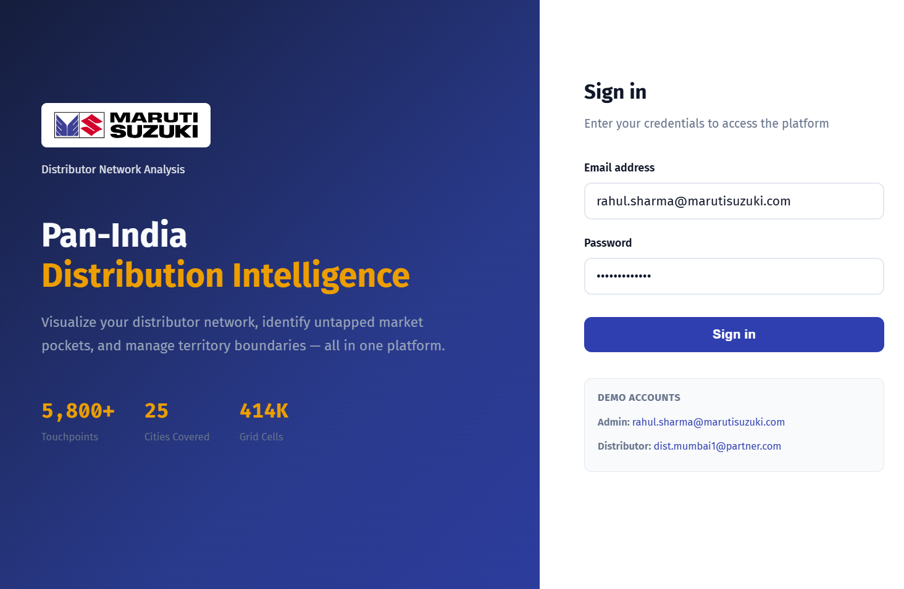
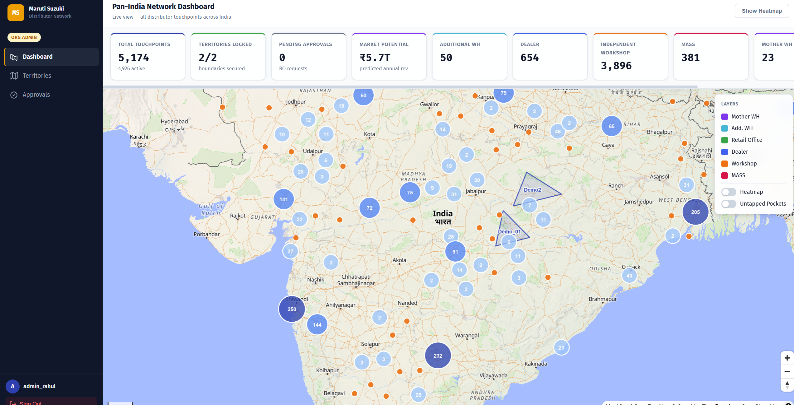
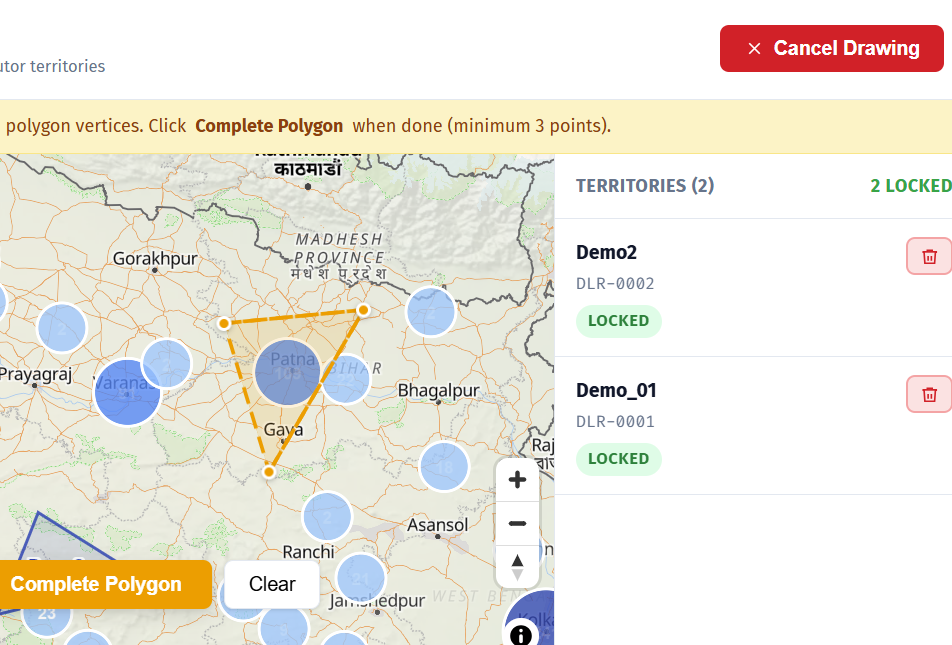
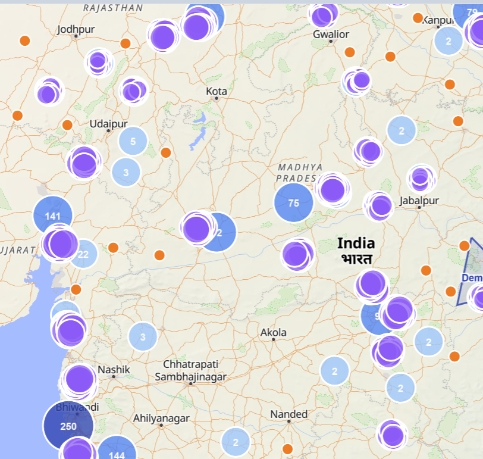
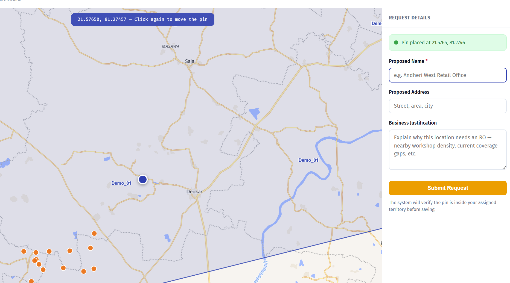
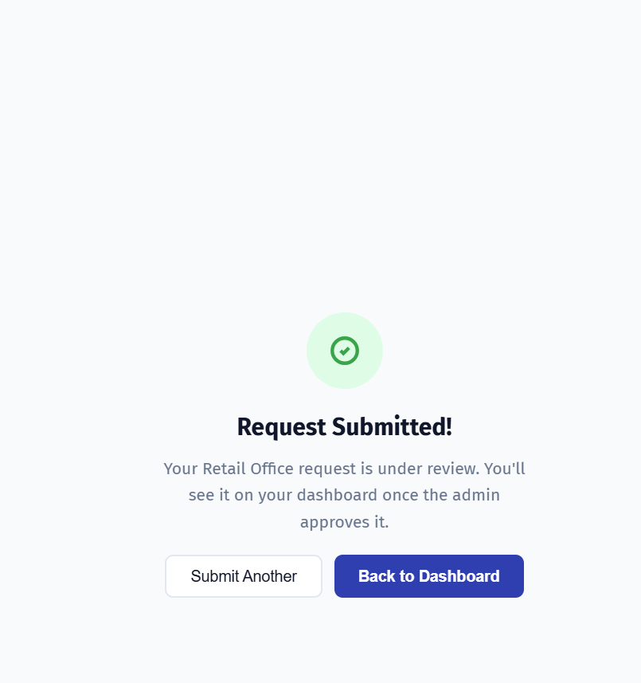

# Distributor Touchpoint & Network Expansion Platform

> **Internship Assignment — Maruti Suzuki India Limited**
> Built as part of a data engineering and geospatial analytics internship to help Maruti Suzuki's Parts & Accessories division manage its pan-India distribution network, identify untapped market pockets, and streamline the approval workflow for new Retail Office expansions.

---

## What It Does

The platform gives two types of users a live, interactive view of Maruti Suzuki's Parts & Accessories network across India:

- **Org Admins** see every touchpoint on a full-screen map (5,800+ locations), run ML-powered market-potential heatmaps, draw and lock distributor territories, and approve or reject Retail Office expansion requests.
- **Distributor Users** see only their assigned territory, discover untapped market pockets identified by a DBSCAN model, and submit geo-pinned Retail Office (RO) expansion requests that automatically go through a territory-boundary and cannibalization check before reaching the admin queue.

---

## Screenshots

### Login


Split-panel login with role-based quick-fill buttons. JWT is stored in React context only — never in `localStorage`.

---

### Admin Dashboard — Pan-India Network View


Full-screen MapLibre map with live KPI strip across the top: total touchpoints, locked territories, pending RO approvals, total predicted market revenue, and a per-type breakdown. Layer toggles on the right let admins switch location types on/off and overlay the ML heatmap or whitespace pockets.

**Request flow:**
```
GET /api/analytics/summary  →  KPI cards
GET /api/locations           →  all 5,800+ map markers (clustered at low zoom)
GET /api/analytics/hotspots  →  ML heatmap (414k grid cells, filtered by score ≥ 0.5)
```

---

### Territory Management — Drawing & Locking


Admin clicks a distributor ID from the list, then draws a polygon directly on the map. Saving it runs a PostGIS `ST_Intersects` check against all **locked** territories — overlapping proposals are rejected with a 409 before any data is written. Once locked, a territory defines the valid boundary for that distributor's RO requests.

**Request flow:**
```
GET  /api/territories               →  list existing territories
POST /api/territories               →  create (overlap check → reject or save)
PATCH /api/territories/{id}/lock    →  lock (activates RO submission for that distributor)
DELETE /api/territories/{id}        →  delete (locked territories show a warning)
```

---

### Distributor Dashboard — My Territory


The distributor sees only their locked polygon, their own touchpoints, and the count of untapped pockets inside their boundary. The "Request New RO" button in the top-right corner launches the RO submission flow.

**Request flow:**
```
GET /api/territories            →  only the distributor's own territory (RBAC filter)
GET /api/locations              →  only touchpoints within the boundary
GET /api/analytics/whitespaces  →  DBSCAN-flagged pockets inside the territory
```

---

### Untapped Market Pockets — Whitespace Detection


Purple clusters mark areas where workshop density is high but no dealer exists within 15 km — identified by a pre-trained DBSCAN model. These are surfaced to the distributor as expansion opportunities directly on their map.

---

### RO Expansion Request — Drop a Pin


The distributor clicks anywhere on their territory to drop a pin, fills in a proposed name, address, and business justification, then submits. The backend runs two checks before saving:

1. **Territory check** — `ST_Within(proposed_point, locked_boundary)` — pin must be inside the distributor's locked polygon.
2. **Cannibalization check** — `ST_DWithin(proposed_point, existing_ROs, 5000m)` — if an existing Retail Office is within 5 km, `conflict_flag` is set to `TRUE` (request still saved, but flagged for admin review).

**Request flow:**
```
POST /api/workflow/request-ro
  Body: { proposed_name, proposed_address, justification, latitude, longitude }
  Step 1: ST_Within check         →  400 if pin is outside the locked territory
  Step 2: ST_DWithin 5 km check   →  sets conflict_flag = TRUE if RO already nearby
  Step 3: INSERT into ro_requests →  201 Created, status = PENDING
```

---

### Submission Confirmed


On success the UI swaps to a confirmation screen. The request lands in the admin's approval queue immediately.

---

### Admin Approvals Queue


Every PENDING request renders as a card with a mini-map showing the proposed pin, the distributor's justification, a conflict-flag warning if applicable, and Approve / Reject buttons with an optional admin note.

**Request flow:**
```
GET  /api/workflow/requests         →  all PENDING requests (admin only)
PATCH /api/workflow/requests/{id}   →  APPROVED or REJECTED
  On APPROVED: auto-inserts a new row in locations (type = 'Retail Office', active = TRUE)
  On REJECTED: stores the admin note, status → REJECTED
```

---

## Tech Stack

| Layer | Technology |
|---|---|
| **Frontend framework** | React 19, Vite 8, React Router v7 |
| **Map engine** | MapLibre GL JS 5 (open-source fork of Mapbox GL, no API key needed) |
| **Map tiles** | OpenFreeMap — free vector tiles, no account required |
| **HTTP client** | Axios with request interceptor (auto Bearer token) and global 401 redirect |
| **Styling** | Tailwind CSS v4, CSS custom properties design system |
| **Backend** | FastAPI (Python 3.11), Uvicorn ASGI server |
| **Async DB driver** | asyncpg — binary-protocol PostgreSQL, no ORM overhead |
| **Database** | PostgreSQL 15 + PostGIS 3.4 |
| **Spatial queries** | `ST_Within`, `ST_Intersects`, `ST_DWithin`, `ST_MakePoint`, `ST_GeomFromGeoJSON` |
| **Auth** | JWT via python-jose, bcrypt password hashing via passlib |
| **Validation** | Pydantic v2, pydantic-settings |
| **ML — market potential** | XGBoost regression, MinMaxScaler (scikit-learn) |
| **ML — whitespace detection** | DBSCAN clustering (scikit-learn) |
| **Infrastructure** | Docker, Docker Compose |

---

## Project Structure

```
Maruti_Suzuki_2/
├── backend/
│   ├── dependencies/
│   │   └── auth.py               # JWT bearer dependency, RBAC role checker
│   ├── models/
│   │   ├── location.py           # Pydantic schemas: map markers, heatmap, whitespace
│   │   ├── territory.py          # Territory create / response / lock schemas
│   │   ├── user.py               # CurrentUser, LoginRequest, TokenResponse
│   │   └── workflow.py           # RO request schemas, analytics summary
│   ├── routers/
│   │   ├── analytics.py          # GET /api/analytics/{hotspots,whitespaces,summary}
│   │   ├── auth.py               # POST /api/auth/login, /logout
│   │   ├── locations.py          # GET /api/locations (viewport-aware, RBAC)
│   │   ├── territories.py        # CRUD + lock + delete for distributor territories
│   │   └── workflow.py           # RO request submission and admin decision
│   ├── config.py                 # pydantic-settings .env loader (cached with lru_cache)
│   ├── database.py               # asyncpg connection pool (created on startup)
│   ├── main.py                   # FastAPI app, CORS middleware, router registration
│   ├── Dockerfile
│   └── requirements.txt
│
├── frontend/
│   ├── public/
│   │   └── maruti-suzuki-logo.svg
│   ├── src/
│   │   ├── api/
│   │   │   └── client.js         # Axios instance: auto Bearer token, global 401 handler
│   │   ├── components/
│   │   │   ├── Map/
│   │   │   │   └── MainMap.jsx   # Core map: view / polygon-draw / pin-drop modes
│   │   │   ├── AppLayout.jsx     # Dark sidebar + main content shell
│   │   │   ├── KPICard.jsx       # Reusable metric card with accent colours
│   │   │   ├── LayerToggle.jsx   # Location-type checkboxes + heatmap toggle
│   │   │   └── ProtectedRoute.jsx # Role-aware route guard
│   │   ├── context/
│   │   │   └── AuthContext.jsx   # JWT in React context (clears on logout/page reload)
│   │   ├── pages/
│   │   │   ├── Login.jsx
│   │   │   ├── AdminDashboard.jsx
│   │   │   ├── TerritoryManager.jsx
│   │   │   ├── DistributorDashboard.jsx
│   │   │   ├── RORequest.jsx
│   │   │   └── Approvals.jsx
│   │   ├── App.jsx               # React Router v7 routes + role-based redirects
│   │   ├── index.css             # Design tokens, MapLibre CSS import, animations
│   │   └── main.jsx
│   ├── Dockerfile
│   ├── nginx.conf                # Serves the built SPA, no proxy needed (CORS handled by FastAPI)
│   └── package.json
│
├── database/
│   ├── schema_creation.txt       # PostgreSQL DDL — run once to create all five tables
│   └── load_data.py              # Seeds the locations table and market_potential_grid
│
├── ml-engine/
│   ├── models/
│   │   ├── market_potential_model.pkl   # Trained XGBoost regressor
│   │   ├── hotspot_scaler.pkl           # MinMaxScaler for 0–1 hotspot scores
│   │   └── dbscan_model.pkl             # Fitted DBSCAN for whitespace clustering
│   ├── plots/
│   │   ├── actual_vs_predicted.png      # Regression evaluation plot
│   │   └── feature_importance.png       # XGBoost feature importance chart
│   ├── train_market_potential.py        # Trains XGBoost on vehicle count / age / commercial %
│   └── detect_whitespaces.py           # Runs DBSCAN, writes is_white_space = TRUE to DB
│
├── data/                          # Raw and processed CSV data files
├── data-generation/               # Scripts that generated synthetic location and sales data
├── screenshots/                   # UI screenshots used in this README
└── docker-compose.yml
```

---

## Database Schema

Five PostGIS-enabled tables:

| Table | Key Columns | Purpose |
|---|---|---|
| `users` | `id VARCHAR`, `role`, `distributor_id` | Accounts — `org_admin` or `distributor_user` |
| `locations` | `geom GEOMETRY(Point, 4326)`, `type`, `active` | 5,800+ physical touchpoints across India |
| `market_potential_grid` | `geom GEOMETRY(Point, 4326)`, `hotspot_score`, `is_white_space` | 414k × 5km grid cells with ML predictions |
| `distributor_territories` | `boundary GEOMETRY(Polygon, 4326)`, `locked` | Polygon boundaries drawn by admins |
| `ro_requests` | `geom GEOMETRY(Point, 4326)`, `status`, `conflict_flag` | Expansion requests — PENDING / APPROVED / REJECTED |

---

## Setup

### Option A — Docker Compose (recommended)

**Prerequisites:** Docker Desktop installed and running.

```bash
# 1. Clone the repository
git clone <repo-url>
cd Maruti_Suzuki_2

# 2. Create the backend environment file
# Windows (PowerShell)
@"
DATABASE_URL=postgresql+asyncpg://postgres:Moneypal_36@db:5432/distributor_gis
JWT_SECRET_KEY=change-this-to-a-long-random-string
JWT_ALGORITHM=HS256
JWT_EXPIRY_MINUTES=480
"@ | Out-File -Encoding utf8 backend/.env

# macOS / Linux
cat > backend/.env <<EOF
DATABASE_URL=postgresql+asyncpg://postgres:Moneypal_36@db:5432/distributor_gis
JWT_SECRET_KEY=change-this-to-a-long-random-string
JWT_ALGORITHM=HS256
JWT_EXPIRY_MINUTES=480
EOF

# 3. Build and start all three services
docker-compose up --build
```

Once the containers are healthy, open a new terminal for the one-time setup:

```bash
# Find the container names
docker ps

# Load the schema into the database
docker exec -i <db-container> psql -U postgres -d distributor_gis < database/schema_creation.txt

# Seed locations and grid data
docker exec <backend-container> python database/load_data.py

# Train the ML models and populate hotspot scores
docker exec <backend-container> python ml-engine/train_market_potential.py
docker exec <backend-container> python ml-engine/detect_whitespaces.py
```

| Service | URL |
|---|---|
| Frontend | http://localhost:3000 |
| Backend API | http://localhost:8000 |
| Swagger docs | http://localhost:8000/docs |

---

### Option B — Manual (local development)

**Prerequisites:** Python 3.11, Node.js 20+, PostgreSQL 15 with PostGIS 3.4.

#### 1. Database

```sql
-- Run in psql as a superuser
CREATE DATABASE distributor_gis;
\c distributor_gis
CREATE EXTENSION postgis;
```

```bash
psql -U postgres -d distributor_gis -f database/schema_creation.txt
```

#### 2. Backend

```bash
# Create and activate virtual environment
python -m venv dna

# Windows
dna\Scripts\activate
# macOS / Linux
source dna/bin/activate

pip install -r backend/requirements.txt
```

Create `backend/.env`:

```
DATABASE_URL=postgresql+asyncpg://postgres:<your-pg-password>@localhost:5432/distributor_gis
JWT_SECRET_KEY=any-long-random-string
JWT_ALGORITHM=HS256
JWT_EXPIRY_MINUTES=480
```

```bash
# Seed the database
python database/load_data.py

# Build and run ML models (populates hotspot_score and is_white_space columns)
python ml-engine/train_market_potential.py
python ml-engine/detect_whitespaces.py

# Start the API server with hot-reload
uvicorn backend.main:app --reload --port 8000
```

API is live at **http://localhost:8000** — interactive docs at **http://localhost:8000/docs**.

#### 3. Frontend

```bash
cd frontend
npm install

# Point the frontend at the local backend
echo "VITE_API_URL=http://localhost:8000" > .env

npm run dev
```

Frontend will be at **http://localhost:5173** (or 5174 if that port is busy).

---

## Demo Accounts

The login page has quick-fill buttons — just click the role chip to auto-populate.

| Role | Email | Password |
|---|---|---|
| Org Admin | rahul.sharma@marutisuzuki.com | `AdminPass@123` |
| Distributor | dist.mumbai1@partner.com | `DistPass@001` |

---

## API Reference

Full interactive docs available at `/docs` (Swagger UI) and `/redoc` when the backend is running.

| Method | Endpoint | Auth | Description |
|---|---|---|---|
| POST | `/api/auth/login` | public | Authenticate, receive JWT |
| GET | `/api/locations` | any | Map markers (viewport + type filters, RBAC) |
| GET | `/api/territories` | any | Admin: all territories; Distributor: own only |
| POST | `/api/territories` | admin | Create territory with overlap check |
| PATCH | `/api/territories/{id}/lock` | admin | Lock a territory |
| DELETE | `/api/territories/{id}` | admin | Delete a territory |
| GET | `/api/analytics/summary` | admin | KPI card data |
| GET | `/api/analytics/hotspots` | any | ML heatmap grid cells |
| GET | `/api/analytics/whitespaces` | any | DBSCAN whitespace pockets |
| POST | `/api/workflow/request-ro` | distributor | Submit RO expansion request |
| GET | `/api/workflow/requests` | admin | Pending RO approval queue |
| GET | `/api/workflow/requests/all` | admin | Full RO history |
| PATCH | `/api/workflow/requests/{id}` | admin | Approve or reject an RO request |
